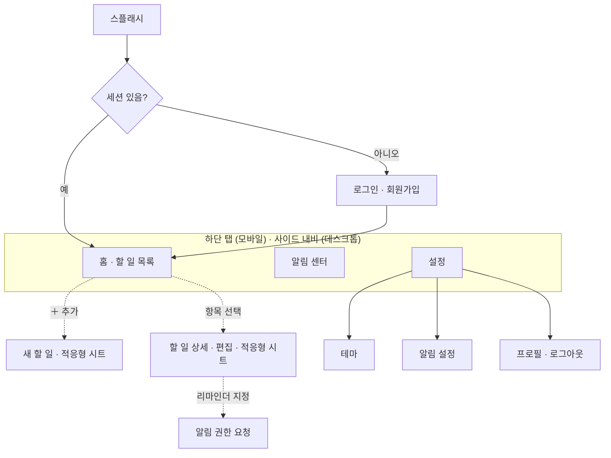

# 스토리보드 — 투두리스트 플랫폼

> 화면의 구성과 화면 사이의 이동을 정리합니다. 프론트엔드에서는 이 흐름이 곧 설계의 중심이므로, 전술적 도메인 모델 대신 이 문서를 설계의 주 산물로 둡니다.
> 컨텍스트 구분은 [전략적설계](%EC%A0%84%EB%9E%B5%EC%A0%81%EC%84%A4%EA%B3%84/%ED%95%98%EC%9C%84%EB%8F%84%EB%A9%94%EC%9D%B8%EC%8B%9D%EB%B3%84.md)를, 확정 범위는 [프로젝트 브리프](../01.%EA%B8%B0%ED%9A%8D/%ED%94%84%EB%A1%9C%EC%A0%9D%ED%8A%B8-%EB%B8%8C%EB%A6%AC%ED%94%84.md)를 따릅니다.

---

## 1. 내비게이션 골격

화면 이동의 큰 줄기입니다. 인증을 통과하면 하단 탭 세 개(홈·알림·설정)를 축으로 이동하고, 할 일의 추가·편집은 탭 위에 겹쳐 뜨는 적응형 시트로 처리합니다.

> 하단 탭은 모바일 표준을 따른 **제안**입니다. 탭 구성(3개)과 데스크톱에서의 사이드 내비 전환은 구현하며 확정합니다.

---

## 2. 화면 목록

| 화면 | 컨텍스트 | 역할 | 핵심 UX |
| ---- | -------- | ---- | ------- |
| 스플래시 | — | PWA 진입, 세션 확인 | 전체 화면, 빠른 첫 페인트 |
| 로그인 · 회원가입 | 사용자 | 인증 | 폼, 포커스 관리, 키보드 회피 |
| 홈 · 할 일 목록 | 할 일 | 오늘/전체 할 일 조회·완료·정렬 | 스와이프 완료·삭제, 가상 스크롤, 당겨서 새로고침 |
| 새 할 일 | 할 일 | 빠른 추가 | 적응형 시트, `safe-area-inset-bottom`, 키보드 대응 |
| 할 일 상세 · 편집 | 할 일 | 편집, 마감·반복·리마인더 지정 | 적응형 시트, 끌어서 닫기 |
| 알림 센터 | 알림 | 알림 목록·읽음 처리 | 스와이프 읽음·삭제 |
| 알림 권한 요청 | 알림 | 브라우저 권한 흐름 | 사전 설명 후 권한 요청 |
| 설정 | 설정 | 환경설정 진입 | 리스트 내비게이션 |
| 테마 | 설정 | 라이트/다크 전환 | 즉시 반영 |
| 알림 설정 | 설정 | 방해금지·on/off | 토글 |
| 프로필 | 사용자 | 프로필 조회·로그아웃 | — |

---

## 3. 핵심 흐름

화면을 잇는 대표 시나리오입니다. 각 흐름의 굵은 동작이 모바일 UX 레이어의 구현 대상이 됩니다.

- **할 일 추가** — 홈의 `＋` → 하단에서 **새 할 일 시트가 올라옵니다**(`transform`) → 입력 후 저장 → 시트가 닫히고 목록 상단에 삽입됩니다.
- **할 일 완료** — 목록 항목을 **스와이프**하면 완료 처리됩니다. 직후 **되돌리기** 스낵바를 띄워 실수를 복구할 수 있게 합니다.
- **리마인더 설정** — 상세에서 마감·리마인더를 지정하면, 할 일 컨텍스트가 알림 컨텍스트의 예약을 호출합니다(전략 설계의 OHS 흐름과 연결). 권한이 없으면 권한 요청 흐름으로 분기합니다.
- **알림 권한** — 권한을 처음 요구하는 순간, 브라우저 기본 팝업을 곧장 띄우지 않고 **이유를 설명하는 시트를 먼저** 보여준 뒤 권한을 요청합니다. 거부 시 설정에서 다시 켜는 경로를 안내합니다.
- **테마 전환** — 설정 → 테마에서 선택하면 **즉시 반영**되고 환경설정에 저장됩니다.

---

## 4. 적응형 표현 규칙

같은 화면을 화면 크기에 따라 다르게 보여줍니다. 컴포넌트는 하나이고, 표현만 분기합니다(`BreakpointObserver`).

| 영역 | 모바일 | 데스크톱 |
| ---- | ------ | -------- |
| 할 일 추가·편집 | 하단에서 올라오는 **바텀시트** | 중앙 **모달** |
| 주 내비게이션 | **하단 탭** | **사이드 내비** |
| 목록 | 단일 컬럼, 가장자리 `safe-area` 패딩 | 넓은 컬럼 또는 그리드 |
| 닫기 동작 | 끌어내리기 제스처 + 백드롭 | 백드롭 클릭 + `Esc` |

이 적응형 시트가 [로드맵](../01.%EA%B8%B0%ED%9A%8D/%ED%94%84%EB%A1%9C%EC%A0%9D%ED%8A%B8-%EB%B8%8C%EB%A6%AC%ED%94%84.md)의 첫 구현 대상이며, 이후 화면들의 참조 구현이 됩니다.

---

## 5. 미정 · 다음

- **인증 방식** — 로그인/회원가입 화면의 구체 흐름은 설계 시 확정합니다.
- **데이터 저장** — 목업·로컬·원격 중 무엇을 쓸지에 따라 로딩·빈 화면·오류 상태의 처리가 달라집니다.
- **빈 화면·로딩·오류 상태** — 각 화면의 비어 있음/로딩/실패 표현은 화면별 설계에서 채웁니다.
- **후속 도메인 화면** — 분류·구성(목록·태그), 협업·공유 등은 범위 확장 시 추가합니다.
