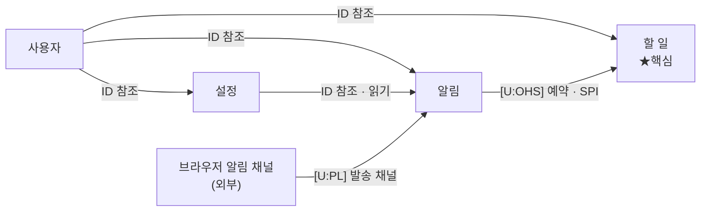

# 바운디드 컨텍스트 · 컨텍스트 맵 — 투두리스트 플랫폼

## 1. 바운디드 컨텍스트

| 컨텍스트 | 하위 도메인 | 책임 | 핵심 언어 |
| -------- | ----------- | ---- | --------- |
| **할 일** | 핵심 | 할 일 실시·기록·정리 | 할일(Task), 목록, 마감일, 반복, 우선순위, 완료, 정렬 |
| **알림** | 지원 | 리마인더 예약·전달 | 알림, 리마인더, 예약, 방해금지, 채널, 발송, 읽음 |
| **사용자** | 일반 | 계정·인증·프로필 | 사용자, 계정, 프로필, 인증, 세션 |
| **설정** | 일반 | 사용자 환경설정 | 설정, 테마, 환경설정, 알림 선호 |

---

## 2. 표기 규약 (Context Mapper 기준)

- **화살표 = 영향 방향**: 꼬리 쪽이 **상류(U)**, 화살촉 쪽이 **하류(D)**. 상류가 바뀌면 하류가 따라 바뀝니다.
- **코드 참조는 반대 방향**(하류 → 상류): 하류가 상류의 ID/계약을 참조합니다.
- **하류 역할은 전부 `CF`(Conformist)** — 이 데모는 ACL을 두지 않으므로 공통 규칙으로 두고 다이어그램에 표기하지 않습니다.
- **상류 역할만 라벨에 표기**: `[U:OHS]`, `[U:PL]` 등. 표기 없는 상류는 "식별자만 소유"(공개 서비스 아님)로 역할이 없습니다.

> **참고 — OHS와 PL은 한 세트가 아닙니다.** PL(공표된 언어/양식)은 OHS 없이도 단독으로 쓰일 수 있고(외부 표준 API·이벤트 스키마 등), OHS가 곧 정식 PL을 뜻하지도 않습니다. 우리 맵에서 상류 역할이 붙는 곳은 **알림(OHS)** 과 **브라우저 알림 채널(PL)** 뿐입니다.

---

## 3. 컨텍스트 맵

**범례** — 화살표 꼬리 = 상류(U), 화살촉 = 하류(D). 하류 역할은 모두 **CF**(공통, 생략).
라벨의 `[U:역할]`은 **상류 역할**, 그 뒤는 통합 수단. 표기 없는 상류는 식별자만 소유(역할 없음).
사용자가 세 컨텍스트의 공통 상류이며, 외부 채널을 제외하면 상류 역할(OHS)이 붙는 곳은 알림뿐입니다.

---

## 4. 엣지별 관계 명세

하류 역할은 전부 CF(생략). 상류 역할은 표기된 곳만.

| 엣지 (상류 → 하류) | Layer 1 — 관계 | 상류 역할 | 통합 수단 |
| ------------------ | -------------- | --------- | --------- |
| 사용자 → 설정 | 일반 상하류(내부) | — | ID 참조 (사용자ID) |
| 사용자 → 할 일 | 일반 상하류(내부) | — | ID 참조 (사용자ID) |
| 사용자 → 알림 | 일반 상하류(내부) | — | ID 참조 (수신자ID) |
| 설정 → 알림 | 일반 상하류(내부) | — | ID 참조 · 읽기 (알림 선호) |
| 알림 → 할 일 | 일반 상하류(내부) | **OHS** | OHS(예약·취소) + SPI(발송 콜백) |
| 브라우저 알림 채널 → 알림 | **Customer-Supplier**(외부) | **PL** | Web Push / Notifications API |

**짚을 점:**

- **알림 → 할 일의 상하류가 역설적인 이유**: 코드 의존은 할 일 → 알림(할 일이 알림 예약을 호출)이지만, **계약(예약 OHS와 발송 SPI)을 알림이 소유**하므로 알림이 상류입니다. DIP로 "필요로 하는 쪽(할 일)이 호출하지만, 인터페이스를 소유한 쪽(알림)이 상류가 되는" 사례입니다.
- **외부 채널의 하류 역할(CF) 주의**: 외부 상류는 통상 **ACL**로 보호하는 것이 정석입니다. 우리는 ACL을 생략(CF)하므로, 브라우저별 권한 모델·페이로드 스키마 차이가 우리 모델로 새어들 위험이 있습니다 → 미확정으로 기록합니다.

---

## 5. 내부 vs 외부 — 관계의 무게가 다릅니다

| 구분 | 대상 | 관계의 실질 |
| ---- | ---- | ----------- |
| **내부** (한 팀·한 코드베이스) | 4개 사내 컨텍스트 | Layer 1 정치 구분 무의미 → **U/D + 통합 수단만** 의미 있음. 하류는 일률 CF, 상류 역할은 알림(OHS)만 |
| **외부** (브라우저·OS) | **브라우저 알림 채널** | 유일한 진짜 Layer 1 관계 → **Customer-Supplier**. Web Push 표준(PL)이 상류. 정석은 우리 쪽 **ACL**이나, 이 데모는 단순화로 CF |

→ 사내 컨텍스트끼리는 패턴 이름에 힘을 빼고, **참조 방향(단방향 유지)과 알림처럼 양방향이 생기는 지점의 OHS/SPI 설계**에 집중합니다.

---

## 6. 경계 너머 참조 규칙

| 대상 | 참조 방식 | 소속 컨텍스트 |
| ---- | --------- | ------------- |
| 사용자·수신자 | `사용자ID`(ID 참조) | 사용자 |
| 알림 선호 | 읽기 (ID 참조) | 설정 |
| 알림 예약·발송 | 예약은 알림 OHS 호출, 발송 확정은 SPI 콜백 | 알림 |

다른 컨텍스트는 객체 참조 대신 식별자(ID) 또는 OHS/SPI로만 연결합니다.
한 트랜잭션은 하나의 애그리거트만 변경하며, 컨텍스트를 넘는 변경은 서비스 호출 또는 콜백으로 처리합니다.
