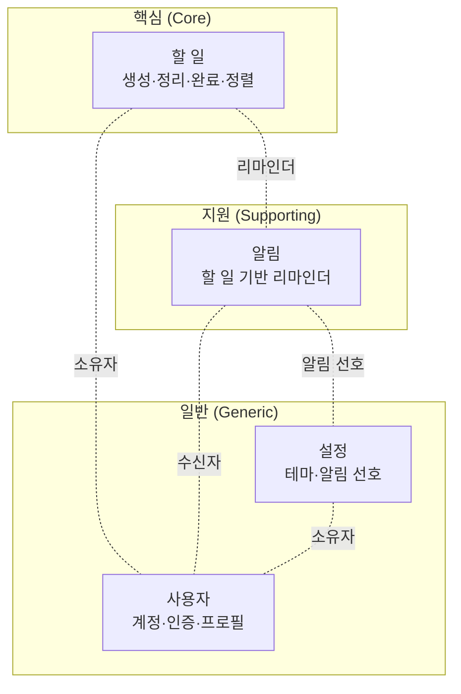

# 하위 도메인 식별 — 투두리스트 플랫폼

> 이 문서는 데모의 도메인을 전략적 관점에서 스케치합니다. 무엇을 직접 만들고 무엇을 기성 솔루션에 맡길지, 역량을 어디에 모을지를 가립니다.
> 이 데모의 실제 차별점은 모바일 UX이지만, 여기서는 비즈니스 도메인 관점에서 분류합니다. UX는 특정 하위 도메인이 아니라 모든 컨텍스트를 가로지르는 표현 계층으로 봅니다.

---

## 1. 분류 기준

| 종류 | 정의 | 처리 방향 |
| ---- | ---- | --------- |
| 핵심(Core) | 서비스의 존재 이유이자 직접 차별화해야 하는 능력 | 직접 구현, 역량 집중 |
| 지원(Supporting) | 핵심을 받치지만 그 자체가 차별점은 아님 | 직접 구현, 적정 수준 |
| 일반(Generic) | 어느 서비스나 동일하며 기성 솔루션이 존재 | 라이브러리·외부 서비스 사용 |

---

## 2. 식별 결과

> 점선은 컨텍스트 간 연관이 있다는 표시일 뿐, **방향(상하류)을 나타내지 않습니다.**
> 상하류·통합 패턴은 컨텍스트 맵에서 다룹니다 → [컨텍스트맵.md](%EC%BB%A8%ED%85%8D%EC%8A%A4%ED%8A%B8%EB%A7%B5.md).

| 하위 도메인 | 분류 | 책임 |
| ----------- | ---- | ---- |
| 할 일 | 핵심 | 할 일의 생성·편집·완료·정렬, 마감일·반복·우선순위 등 생명주기 관리 |
| 알림 | 지원 | 할 일의 마감·리마인더에 따른 알림 예약·전달, 방해금지 등 규칙 |
| 사용자 | 일반 | 계정·로그인·프로필·세션 |
| 설정 | 일반 | 테마·알림 선호 등 사용자 환경설정 |

> 알림의 전달 채널 자체는 어느 앱에나 있는 일반 기능에 가깝습니다. 다만 "언제·무엇을 알릴지"를 정하는 리마인더 규칙이 할 일의 생명주기에 깊이 결합되므로, 일반이 아니라 지원으로 분류합니다.

> 설정은 환경설정 저장이라는 일반 능력입니다. 다만 그 안에 담기는 값(알림 선호 등)은 다른 컨텍스트의 동작에 영향을 줍니다. 저장 메커니즘은 일반으로 두되, 값의 의미는 그것을 읽는 컨텍스트가 해석합니다.

---

## 3. 후속(미착수) 하위 도메인

할 일 본체와 연결되나 이번 범위 밖이며, 별도 식별이 필요한 영역입니다.

| 하위 도메인 | 할 일과의 관계 |
| ----------- | -------------- |
| 분류·구성 (목록·태그·프로젝트) | 할 일을 묶는 상위 구조 |
| 협업·공유 | 할 일 공유, 담당자 지정 |
| 반복·일정 | 반복 규칙, 캘린더 형태의 조회 |
| 통계·회고 | 완료율, 주간 리뷰 |
| 오프라인 동기화 | PWA 오프라인 편집과 충돌 해소 (서버 도입 시) |
| 검색 | 할 일 전문 검색 |

---
