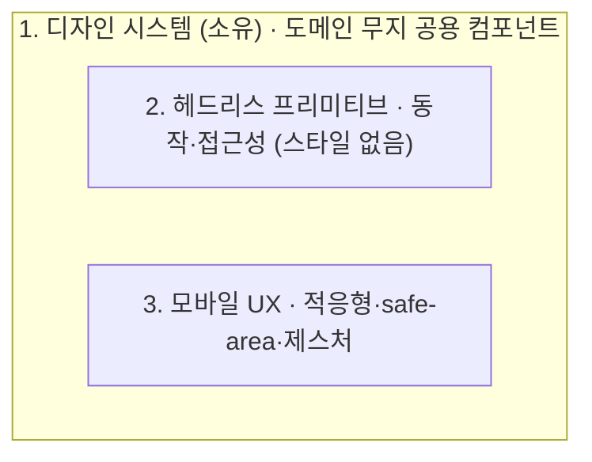

# 모바일 웹 UX 디자인

반응형 웹앱을 만들고 나면 데스크톱에서는 멀쩡한데 모바일에서는 어딘가 웹 같은 위화감이 남는다. 이 스킬은 그 위화감을 줄여 모바일에서도 앱처럼 느끼게 만드는 설계 방법을 다룬다. 중요한 것은 특정 프레임워크의 문법이 아니라 책임을 어떻게 나누고 어디에 두느냐이며, 그래서 이 레포의 Angular 구현은 가능한 여러 구현 중 하나일 뿐이다. 원칙은 React나 Svelte로도 그대로 옮겨진다.

## 언제 쓰나

모바일에서 바텀시트나 모달, 끌어서 닫기, 스와이프 같은 터치 제스처가 필요할 때 이 스킬을 편다. 화면 크기에 따라 레이아웃이 아니라 표현 자체가 바뀌어야 할 때(바텀시트와 모달, 탭바와 사이드 레일), safe-area나 44px 터치 타깃, 다크/라이트 같은 모바일 디테일을 챙겨야 할 때도 해당한다. 완성된 UI 프레임워크를 채택할지 디자인을 직접 소유할지 저울질하는 단계에도 쓸 수 있다.

## 갈림길: 라이브러리에 맡길까, 소유할까

가장 쉬운 길부터 인정하고 시작하는 것이 옳다. Ionic이나 Angular Material 같은 완성형 프레임워크는 스타일과 헤드리스 동작을, Ionic의 경우 모바일 UX의 상당 부분까지 한꺼번에 제공한다. 검증된 접근성과 빠른 출발이 그 보상이고, 작은 팀이 빨리 출시해야 한다면 합리적인 선택이다.

대가는 제어권이다. 컴포넌트가 마크업을 캡슐화할수록 바깥에서 정의한 스타일이 안쪽까지 닿지 못하고, 디자인의 상당 부분을 프레임워크의 언어에 위임하게 된다. 결과물이 그 프레임워크처럼 보이는 것을 피하기 어렵다.

디자인 시스템의 소유권을 가지려는 쪽은 이 제어권을 되찾는 대신 시간과 전문성을 치른다. 다만 한 가지 오해를 짚어 둘 필요가 있다. 소유한다고 해서 헤드리스 프리미티브를 처음부터 짜는 것은 아니다. 포커스 트랩이나 오버레이 같은 동작은 여전히 CDK나 Radix에서 차용하고, 그 위에 배선과 스타일만 얹는다. 즉 소유란 외형을 소유하고 동작을 빌리는 일이다. 이 스킬은 소유하는 길을 세 층으로 풀어낸다.

## 세 개의 층

소유하기로 했다면 책임을 세 층으로 나눈다.

도식이 말하는 핵심은, 이 층들이 나란히 포개져 따로 노는 것이 아니라 1층이 아래를 감싸 안는 관계라는 것이다. 디자인 시스템이 내놓는 것은 도메인을 모르는 순수한 공용 컴포넌트이고, 그 컴포넌트가 안에서 필요한 만큼 헤드리스 동작(2층)과 모바일 UX(3층)를 품는다. 시트가 그렇다. 바깥에는 열림 상태와 컨텐츠만 내보이지만, 안에서는 오버레이와 포커스 트랩을 차용하고 화면 크기에 따라 바텀시트와 모달로 갈리는 분기까지 삼킨다. 그 적응 분기는 소비자에게 보이지 않는 내부 조건일 뿐이다. 품는 정도는 컴포넌트마다 다르다. 버튼은 거의 품지 않고, 시트는 많이 품는다. 도메인을 아는 컴포넌트는 이 순수 프리미티브를 조합해 만들 뿐, 프리미티브는 끝까지 도메인을 모른다.

## 쌓는 순서

순서에는 이유가 있다. 시각 토대를 먼저 깐다. 모든 시각 작업이 토큰에 의존하므로 색·간격·라운드·브레이크포인트·폰트를 `@theme`에 정의하는 것이 1층의 출발점이다([references/01-design-system.md](references/01-design-system.md)).

다음으로 헤드리스 프리미티브를 차용해 오버레이·포커스 트랩·브레이크포인트 관찰을 손에 넣는다([references/02-headless-primitives.md](references/02-headless-primitives.md)). 그 위에서 적응형 시트를 가장 먼저 조립한다. 시트 하나가 이후 모든 모바일 UX 패턴의 참조 구현이 되기 때문이다. 적응형 분기, safe-area, 제스처, 가상 스크롤이 모두 여기서 모인다([references/03-adaptive-ux.md](references/03-adaptive-ux.md)).

## 변치 않는 원칙

몇 가지 원칙은 층을 가로질러 유지된다.

**Tailwind 클래스는 구현 디테일이며 공개 API가 아니다.** 디자인 시스템은 클래스 이름이 아니라 컴포넌트를 노출한다. 클래스를 밖으로 흘리는 순간 그것이 사실상의 API가 되어, 이후 내부를 바꾸기 어려워진다.

**접근성은 헤드리스 층에 둔다.** 포커스·키보드·ARIA·알림은 외형이 아니라 동작과 의미의 문제다. 동작 층에 두면 스타일을 아무리 바꿔도 접근성이 깨지지 않는다.

**열기·닫기 애니메이션은 transform과 opacity만 건드린다.** 레이아웃을 건드리지 않아야 컴포지터에서 부드럽게 돈다.

**제스처는 거리만이 아니라 속도까지 본다.** 얼마나 끌었는가와 함께 얼마나 빨리 던졌는가로 닫을지 되돌릴지를 판정해야 손맛이 산다.

## 레퍼런스 구현 (이 레포)

- 토큰: `src/styles.css` (`@theme`, `[data-theme=light]`)
- 프리미티브: `src/shared/ui/` (Button, Sheet, ListItem, Snackbar, Checkbox)
- 적응형 기준점: `src/shared/lib/breakpoint.ts`
- 제스처 공통: `src/shared/lib/gsap.ts`
- 적응형 시트(참조 구현의 심장): `src/shared/ui/sheet/sheet.ts`
- 적응형 내비: `src/widgets/app-nav/app-nav.ts`
- 데이터(로컬 우선): `src/shared/api/` (Dexie + liveQuery)
